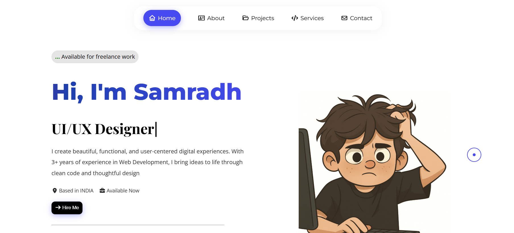

# 🚀 Samradh Srivastava — Personal Portfolio


### Building ideas into products using AI, Web Development & Creative Engineering

🌐 Live Demo: https://new-portfolio001.netlify.app/  
💻 GitHub: https://github.com/vs-sam007/Portfolio-1


---

## ✨ About The Project

This portfolio is more than a personal website — it's a digital representation of my journey as a developer and builder.

Designed with smooth animations, modern UI elements, and interactive experiences, this project showcases my skills, projects, creativity, and passion for turning ideas into real products.

The goal was simple:

> Build a portfolio that feels memorable instead of looking like another template.

---

## 🔥 Features

✅ Modern responsive UI  
✅ Smooth scrolling experience  
✅ Interactive animations  
✅ Projects showcase section  
✅ Skills & tech stack display  
✅ Contact section  
✅ Mobile-friendly design  
✅ Fast loading experience  
✅ Clean and minimal design

---

## 🛠 Tech Stack

**Frontend**

- HTML5
- CSS3
- JavaScript

**Libraries & Tools**

- GSAP
- Locomotive Scroll
- Git
- GitHub

---

## 📂 Project Structure

```bash
Portfolio-1/
│
├── assets/
├── images/
├── index.html
├── style.css
├── script.js
└── README.md
```

---

## ⚡ Installation

Clone the repository:

```bash
git clone https://github.com/vs-sam007/Portfolio-1.git
```

Move into folder:

```bash
cd Portfolio-1
```

Open:

```bash
index.html
```

or run using Live Server.

---

## 📸 Preview


<a href="https://new-portfolio001.netlify.app/" target="_blank">
   
</a>
---

## 🎯 Purpose

This portfolio was built to:

- Showcase projects and skills
- Build an online developer identity
- Create a unique experience for recruiters and visitors
- Experiment with animations and UI interactions

---

## 🚧 Future Improvements

- Dark/Light mode toggle
- Dynamic project fetching
- Blog section
- AI chatbot integration
- Performance optimizations
- More interactive sections

---

## 👨‍💻 About Me

Hi, I'm **Samradh Srivastava**

B.Tech student, developer, and builder passionate about:

- AI Products
- Web Development
- Startups
- Automation
- Solving real-world problems

Currently working on projects involving AI and scalable product ideas.

---

## 🤝 Connect With Me

GitHub: https://github.com/vs-sam007

Portfolio: https://new-portfolio001.netlify.app/

---


### If you like this project, give it a ⭐

Building. Learning. Improving.

